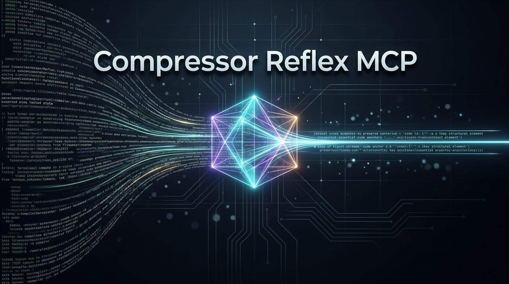

# Compressor Reflex MCP

<p align="center">
  
</p>

<p align="center">
  <a href="https://pypi.org/project/compressor-reflex-mcp/"></a>
  <a href="https://huggingface.co/aialchemist-dev/compressor-reflex"></a>
  <a href="https://opensource.org/licenses/MIT"></a>
  <a href="https://www.python.org/downloads/"></a>
  <a href="https://modelcontextprotocol.io/"></a>
</p>

Compressor Reflex MCP is a Model Context Protocol (MCP) server and transparent proxy that provides high-fidelity tool-output compression for Cursor, Antigravity IDE, Claude Desktop, and other MCP-compliant developer environments.

Powered by [`aialchemist-dev/compressor-reflex`](https://huggingface.co/aialchemist-dev/compressor-reflex) (fine-tuned ModernBERT-151M), the model reduces tool-output token consumption by up to 90% while guaranteeing 100% retention of compiler errors, test failures, target locations, and decisive anchors.

---

## Key Capabilities

- **89.7% Measured Tool Compression:** Condenses extensive test suites, git diffs, directory listings, and file dumps into their essential operational lines.
- **100.0% Critical Anchor Retention:** Calibrated at decision threshold tau* = 0.50 across held-out evaluations. Error tracebacks, fail signatures, and query targets remain intact.
- **Fail-Open Bypass Policy:** Outputs containing <= 5 physical lines or <= 64 tokens automatically bypass compression and pass through verbatim, avoiding latency overhead on short outputs.
- **Dual Deployment Modes:**
  1. **Direct MCP Tools:** Exposes standard callable tools (`compress_tool_output`, `compress_file`) for explicit agent invocation.
  2. **Transparent Proxy:** Wraps any standard MCP server (such as filesystem, git, or terminal) to automatically compress output streams before delivery to the context window.
- **Automated Weight Management:** Model weights (INT8 ONNX) and tokenizers are automatically retrieved from Hugging Face Hub on initial startup and cached locally.

---

## Installation

### From PyPI

```bash
pip install compressor-reflex-mcp
```

Or run directly without installation via `uvx`:

```bash
uvx compressor-reflex-mcp serve
```

### From Source or Git

```bash
git clone https://github.com/ericmaddox/compressor-reflex-mcp.git
cd compressor-reflex-mcp
pip install -e .
```

### Optional Model Pre-Caching

To download the model weights ahead of time:

```bash
compressor-reflex-mcp download
```

Model files are cached in the standard user cache directory (`~/.cache/compressor-reflex/` or `%LOCALAPPDATA%/compressor-reflex/`). The cache path can be overridden using the `COMPRESSOR_MODEL_DIR` environment variable.

---

## IDE Configuration

### Cursor

Add the server definition to your workspace `.cursor/mcp.json` or global Cursor settings:

```json
{
  "mcpServers": {
    "compressor-reflex": {
      "command": "python",
      "args": ["-m", "compressor_reflex_mcp.server"]
    }
  }
}
```

Or using `uvx`:

```json
{
  "mcpServers": {
    "compressor-reflex": {
      "command": "uvx",
      "args": ["compressor-reflex-mcp", "serve"]
    }
  }
}
```

### Antigravity IDE

Add to `~/.gemini/config/mcp_config.json` or your project `.gemini/mcp_config.json`:

```json
{
  "mcpServers": {
    "compressor-reflex": {
      "command": "python",
      "args": ["-m", "compressor_reflex_mcp.server"]
    }
  }
}
```

#### Transparent Proxy Mode (Antigravity and Cursor)

Wrap existing tools to automatically compress outputs from heavy providers (for example, filesystem or git inspection):

```json
{
  "mcpServers": {
    "filesystem-compressed": {
      "command": "compressor-reflex-mcp",
      "args": [
        "proxy",
        "--",
        "npx",
        "-y",
        "@modelcontextprotocol/server-filesystem",
        "."
      ]
    }
  }
}
```

### Claude Desktop

Update `claude_desktop_config.json`:

```json
{
  "mcpServers": {
    "compressor-reflex": {
      "command": "python",
      "args": ["-m", "compressor_reflex_mcp.server"]
    }
  }
}
```

---

## Tool Reference

| Tool | Parameters | Description |
| :--- | :--- | :--- |
| `compress_tool_output` | `text` (required), `intent` (optional), `threshold` (optional, default: 0.50) | Extracts relevant lines from raw terminal stdout, test logs, or diffs with optional intent routing. |
| `compress_file` | `file_path` (required), `intent` (optional), `threshold` (optional, default: 0.50) | Reads a file from disk and extracts decisive lines based on the provided intent. |
| `get_model_status` | None | Returns metadata on local model cache status, Hugging Face Hub link, and threshold settings. |

---

## Command-Line Interface

```bash
# Launch the stdio MCP server
compressor-reflex-mcp serve

# Run as transparent proxy wrapping another command
compressor-reflex-mcp proxy -- npx -y @modelcontextprotocol/server-filesystem /path/to/project

# Compress a file or standard input directly
compressor-reflex-mcp compress tests/results.log --intent "find failures"

# Verify model cache and runtime configuration
compressor-reflex-mcp info

# Pre-fetch weights from Hugging Face
compressor-reflex-mcp download
```

---

## Empirical Performance

Metrics collected across real multi-turn developer sessions in IDE environments:

| Metric | Measured Value | Methodology / Context |
| :--- | :---: | :--- |
| **Tool Compression Ratio** | **89.69%** | Measured over 181 tool outputs (129,405 raw to 13,339 kept tokens) |
| **Critical Anchor Retention** | **100.0%** | 611/611 anchor lines preserved at calibrated threshold tau* = 0.50 |
| **Fail-Open Bypass Rate** | **9.39%** | Automatically bypassed on outputs with <= 5 physical lines or <= 64 tokens |
| **Maximum Single-Session Savings** | **60.54%** | Measured in deep multi-module code exploration session |
| **Model Size** | **143 MB** | INT8 quantized ONNX (ModernBERT-151M) |

---

## Agent Instructions

For system prompt guidelines and autonomous agent behavior rules, refer to [`AGENTS.md`](./AGENTS.md).

---

## License

This project is licensed under the MIT License. See [LICENSE](./LICENSE) for details.  
Model architecture and pre-trained weights are hosted at [Hugging Face](https://huggingface.co/aialchemist-dev/compressor-reflex).